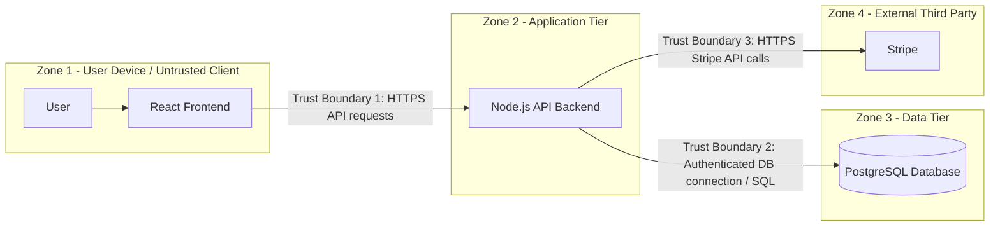

# E-commerce Platform Threat Model

## 1. Scope and Architecture

This threat model covers an e-commerce platform with the following functionality:

- Product browsing without authentication
- Adding products to a cart without authentication
- Checkout and payment with authentication
- Viewing order history with authentication

The platform uses:

- React frontend
- Node.js API backend
- PostgreSQL database
- Stripe payment integration

The main assets that need protection are customer accounts, authentication sessions, order information, product and pricing data, payment-related data, and the integrity of the checkout process.

## 2. Architecture and Trust Boundaries



### Trust Boundary 1: User browser → Node.js API

The browser is an **untrusted environment** because the user controls it. Requests can be modified with browser developer tools, Burp Suite, curl, or other tools before they reach the server.

For example, a user could change a request from:

```json
{
  "productId": 123,
  "price": 899.99,
  "quantity": 1
}
```

to:

```json
{
  "productId": 123,
  "price": 8.99,
  "quantity": 1
}
```

The backend must therefore never assume that price, quantity, discounts, user IDs, or other security-sensitive values supplied by the frontend are trustworthy. The server should retrieve authoritative prices from the database and calculate the final total itself.

### Trust Boundary 2: Node.js API → PostgreSQL database

The API crosses from the application layer into the data layer. This boundary is important because the database contains valuable and potentially sensitive information.

If the API creates SQL queries unsafely from user input, an attacker may be able to manipulate the query. Database access should therefore use parameterised queries, a dedicated database account with least privilege, and tightly controlled credentials.

### Trust Boundary 3: Node.js API → Stripe

Stripe is an external third-party service, so communication with it crosses an organisational and system trust boundary.

The application must validate requests and responses, use HTTPS, protect Stripe API credentials, verify payment status server-side, and avoid trusting a payment result supplied only by the browser. Payment success should be confirmed using trusted information from Stripe before an order is marked as paid.

---

# 3. STRIDE Threats for the Checkout Process

STRIDE is used to categorise threats as **Spoofing, Tampering, Repudiation, Information Disclosure, Denial of Service,** and **Elevation of Privilege** [1].

## Threat 1 — Tampering with price or order values

| Item | Analysis |
|---|---|
| **STRIDE category** | Tampering |
| **Threat description** | An attacker modifies checkout data sent by the React frontend, such as the product price, quantity, discount, shipping cost, or total. |
| **Attack scenario** | The attacker adds a €900 product to the basket, intercepts the checkout request using browser developer tools or Burp Suite, changes the submitted price to €9, and forwards the modified request to the Node.js API. If the backend trusts the client-side price, the attacker may be able to purchase the product for the modified amount. |
| **Potential impact** | Direct financial loss, fraudulent orders, corrupted transaction records, inventory problems, and loss of customer or business trust. |
| **Likelihood** | **High.** Client-side requests are easy for a user to inspect and modify. If server-side validation is missing, exploitation requires little specialised access. |
| **Mitigation** | Never trust prices or totals supplied by the frontend. The backend should retrieve the product price from PostgreSQL, validate quantities and discounts, calculate the final order total server-side, and send only the trusted amount to Stripe. Suspicious price or cart changes should also be logged. |

The key rule here is simple: **the browser can display the price, but the server decides the price**. Otherwise, the checkout system is basically asking customers how much they feel like paying.

---

## Threat 2 — Spoofing another customer's identity

| Item | Analysis |
|---|---|
| **STRIDE category** | Spoofing |
| **Threat description** | An attacker obtains or abuses another user's authentication credentials or active session and performs checkout as that user. |
| **Attack scenario** | An attacker steals a customer's session token through another compromise, phishing attack, insecure storage, or exposed cookie. The attacker then submits authenticated checkout requests using the victim's session and may place orders or access account-related information as the victim. |
| **Potential impact** | Unauthorised purchases, exposure of personal information, account takeover, fraudulent transactions, chargebacks, and reputational damage. |
| **Likelihood** | **Medium.** Authentication is required for checkout, so the attacker needs valid credentials or a usable session. However, account and session theft are common attack objectives. |
| **Mitigation** | Use secure session management, HTTPS, `Secure`, `HttpOnly`, and appropriate `SameSite` cookie settings, short-lived sessions where appropriate, strong password storage, login rate limiting, optional MFA, and server-side authorisation checks on every checkout and order-history request. |

---

## Threat 3 — Disclosure of payment or checkout information

| Item | Analysis |
|---|---|
| **STRIDE category** | Information Disclosure |
| **Threat description** | Sensitive checkout, customer, authentication, or payment-related information is exposed while being transmitted, stored, or logged. |
| **Attack scenario** | A poorly configured checkout implementation sends sensitive information without adequate transport protection, stores unnecessary payment details, or writes confidential request data into application logs. An attacker who gains access to network traffic, logs, or a compromised server could then obtain this information. |
| **Potential impact** | Exposure of customer information, payment fraud, regulatory consequences, incident-response costs, and loss of customer trust. |
| **Likelihood** | **Medium.** HTTPS and Stripe reduce some risk when implemented correctly, but insecure logging, token leakage, or configuration mistakes can still expose sensitive information. |
| **Mitigation** | Enforce HTTPS/TLS, use Stripe's payment mechanisms rather than storing raw card information in the application's own database, protect API keys, minimise sensitive data collection, redact secrets and payment-related data from logs, and restrict access to production logs and systems. |

---

# 4. DREAD Assessment — SQL Injection in Product Search

## Threat description

The product-search feature is publicly accessible and does not require authentication. If the Node.js backend builds SQL statements by directly combining user-supplied search text with a SQL query, an attacker could insert SQL syntax that changes the intended query.

For example, unsafe code might conceptually behave like this:

```javascript
const query =
  "SELECT * FROM products WHERE name LIKE '%" + searchTerm + "%'";
```

An attacker could submit specially crafted input rather than a normal product name. Depending on the database permissions and the exact vulnerability, successful SQL injection could expose, modify, or delete information.

OWASP recommends prepared statements with parameterised queries as a primary defence against SQL injection [2][3].

## DREAD Formula

For this exercise, each DREAD category is scored from **1 (low)** to **10 (high)**.

**DREAD score = (Damage + Reproducibility + Exploitability + Affected Users + Discoverability) / 5**

| DREAD factor | Score | Reasoning |
|---|---:|---|
| **Damage Potential** | **9/10** | A successful SQL injection could potentially expose or alter product, customer, account, or order information depending on the database permissions available to the application. It could also damage data integrity and business operations. |
| **Reproducibility** | **9/10** | Once a working payload is identified, the same vulnerable search request can normally be repeated reliably until the vulnerability is fixed or blocked. |
| **Exploitability** | **8/10** | The search field is public and requires no account. Common SQL injection techniques and testing tools reduce the effort required, although successful exploitation still depends on the exact query construction and database behaviour. |
| **Affected Users** | **9/10** | The application uses a shared backend database. A serious database compromise could therefore affect a large portion of customers rather than a single account. |
| **Discoverability** | **10/10** | Product search is intentionally visible to every visitor. An attacker does not need to discover a hidden endpoint before testing the input. |

### Calculation

```text
DREAD = (9 + 9 + 8 + 9 + 10) / 5
      = 45 / 5
      = 9.0 / 10
```

### Overall Risk Rating: HIGH

A score of **9.0/10** makes SQL injection in the public product-search feature a **high-priority threat**.

The strongest reason for prioritising it is the combination of:

- public unauthenticated access;
- easy discoverability;
- repeatable exploitation if the flaw exists; and
- potentially broad access to a shared database.

## SQL Injection Mitigation

The following controls should be implemented:

1. **Use parameterised queries or prepared statements.** User input must be treated as data rather than executable SQL syntax.
2. **Avoid dynamically concatenating user input into SQL strings.**
3. **Validate input**, including expected length and format, as an additional control.
4. **Apply least privilege to the application's PostgreSQL account.** The web application should not connect using a highly privileged database administrator account.
5. **Return generic database errors to users.** Detailed SQL errors should be logged securely rather than displayed in the browser.
6. **Monitor abnormal search requests** and repeated database errors.
7. **Test the search endpoint during security testing** before release and after significant changes.

A Web Application Firewall may provide an additional defensive layer, but it should **not** replace secure query construction.

---

# 5. Prioritisation and Real-World Constraints

Not every organisation has unlimited budget or security staff, so the first controls should be the ones that reduce the most serious risks without creating unnecessary complexity.

### Immediate / low-to-medium effort

- Recalculate all prices and totals on the Node.js backend.
- Use parameterised PostgreSQL queries.
- Enforce HTTPS.
- Validate authentication and authorisation server-side.
- Protect session cookies.
- Keep Stripe secret keys out of frontend code and source control.
- Remove sensitive information from application logs.

These controls should be treated as release requirements because they directly prevent high-impact attacks.

### Next priority

- Add centralised security logging and alerting.
- Add rate limiting for login and sensitive API endpoints.
- Review database account permissions.
- Add automated security tests to the development pipeline.
- Consider MFA for higher-risk accounts or administrative functions.

### Additional defence

If budget and resources allow, the company could add a Web Application Firewall, enhanced fraud detection, external penetration testing, and more advanced monitoring. These controls add defence in depth, but they should come **after** fixing vulnerabilities in the application itself.

---

# 6. Conclusion

The checkout process crosses several important trust boundaries and handles high-value assets, so client input must never be treated as trusted simply because it came from the React application.

The three main STRIDE threats identified are:

- **Tampering** with price and order information
- **Spoofing** authenticated customers
- **Information Disclosure** involving checkout or payment-related information

The SQL injection assessment produced a **DREAD score of 9.0/10**, meaning it should be treated as a high-priority risk. Parameterised queries, least-privilege database access, server-side validation, and secure error handling provide practical mitigations.

Overall, the most important design principle is to keep trust decisions on the server: the frontend can request an action, but the backend must independently verify whether that action is valid.

---

# References

[1] Microsoft Learn, **Microsoft Threat Modeling Tool threats**.  
https://learn.microsoft.com/en-us/azure/security/develop/threat-modeling-tool-threats

[2] OWASP Cheat Sheet Series, **SQL Injection Prevention Cheat Sheet**.  
https://cheatsheetseries.owasp.org/cheatsheets/SQL_Injection_Prevention_Cheat_Sheet.html

[3] OWASP Cheat Sheet Series, **Query Parameterization Cheat Sheet**.  
https://cheatsheetseries.owasp.org/cheatsheets/Query_Parameterization_Cheat_Sheet.html
