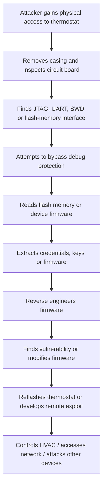

# IoT Smart Thermostat Threat Model

## 1. System Overview

This threat model covers a smart thermostat that:

- Connects to home Wi-Fi
- Controls heating and cooling systems
- Collects temperature data
- Receives commands from a mobile application
- Receives firmware updates Over-The-Air (OTA)

Unlike a normal web application, the thermostat is a **physical embedded device** installed in a user's home. This creates additional risks involving hardware, firmware, sensors, local interfaces, and physical access.

NIST's IoT cybersecurity baseline identifies important device capabilities such as secure configuration, data protection, restricted access to interfaces, secure software updates, and cybersecurity state awareness [1].

---

# 2. IoT-Specific Threats

Some IoT threats overlap with ordinary application security, but the following risks are especially important because the thermostat contains physical hardware, embedded firmware, sensors, and device-level interfaces.

## Threat 1 — Physical Tampering and Debug-Port Access

| Item | Analysis |
|---|---|
| **Threat description** | An attacker physically opens the thermostat and accesses internal interfaces such as JTAG, UART, SWD, or exposed test points. |
| **Attack scenario** | The attacker removes the thermostat from the wall, opens the casing, locates a debug interface, and connects hardware tools to interact directly with the device. If the debug interface is not disabled or protected, the attacker may read memory, alter firmware, or bypass normal software security controls. |
| **Potential impact** | Extraction of credentials or encryption keys, firmware modification, device takeover, discovery of vulnerabilities that can later be exploited remotely, or disruption of heating and cooling. |
| **Likelihood** | **Medium.** Physical access is required, but home IoT devices are often accessible to household members, visitors, landlords, maintenance workers, or someone who steals the device. |
| **Mitigation** | Disable production debug interfaces where possible, require authentication for maintenance interfaces, protect sensitive hardware, use tamper-resistant casing or seals where justified, encrypt sensitive stored data, and store cryptographic keys in protected hardware. |

This is a major difference from an ordinary web application: an attacker may be able to literally unscrew the security boundary.

---

## Threat 2 — Firmware Extraction and Reverse Engineering

| Item | Analysis |
|---|---|
| **Threat description** | An attacker obtains a copy of the thermostat's firmware and analyses it to discover secrets, vulnerabilities, protocols, or hidden functionality. |
| **Attack scenario** | The attacker reads firmware directly from flash memory or downloads an OTA firmware image. They then reverse engineer the image and discover hard-coded API credentials, encryption keys, undocumented services, or vulnerable code. |
| **Potential impact** | Compromise of individual devices or potentially an entire product line if shared secrets are discovered. The attacker may also develop reliable remote exploits using information learned from the firmware. |
| **Likelihood** | **Medium to High.** Firmware extraction requires some technical skill, but once one device is obtained, the attacker can spend unlimited time analysing it offline. |
| **Mitigation** | Avoid hard-coded shared secrets, use per-device credentials, protect sensitive key material using secure hardware, minimise exposed information, disable unnecessary interfaces, and use secure development and code-review practices. |

---

## Threat 3 — Insecure or Malicious Firmware

| Item | Analysis |
|---|---|
| **Threat description** | The device accepts firmware that has not been authorised by the manufacturer or fails to verify firmware integrity before installation. |
| **Attack scenario** | An attacker compromises the update process and provides a modified firmware image containing a backdoor. If the thermostat does not verify a trusted digital signature, it installs and runs the attacker's code. |
| **Potential impact** | Complete device takeover, persistent malware, surveillance, use of the thermostat as a foothold into the home network, and manipulation of heating or cooling. |
| **Likelihood** | **High if updates are unsigned or weakly verified.** Firmware runs with extensive control over the device, so a weak update mechanism creates a very high-impact path. |
| **Mitigation** | Digitally sign firmware, verify signatures before installation, protect signing keys, implement secure boot, reject unauthorised images, and maintain a secure recovery mechanism. |

OWASP identifies lack of a secure update mechanism as a major IoT security weakness [2].

---

## Threat 4 — Firmware Rollback Attacks

| Item | Analysis |
|---|---|
| **Threat description** | An attacker forces the thermostat to install an older but legitimately signed firmware version containing known vulnerabilities. |
| **Attack scenario** | Version 4.2 fixes a serious remote-code-execution vulnerability. The attacker obtains a genuine signed copy of version 3.7 and tricks the thermostat into reinstalling it. Because the old image still has a valid manufacturer signature, signature checking alone would not stop the attack. |
| **Potential impact** | Reintroduction of known vulnerabilities, remote compromise, persistence of attacks, and bypass of security improvements. |
| **Likelihood** | **Medium.** The attacker needs access to an older firmware image and a way to influence the update process, but old firmware may be publicly downloadable or recoverable from another device. |
| **Mitigation** | Implement anti-rollback protection, maintain a trusted minimum firmware version or monotonic version counter, and allow downgrade only through a tightly controlled recovery procedure. |

---

## Threat 5 — Sensor Manipulation

| Item | Analysis |
|---|---|
| **Threat description** | An attacker interferes with the thermostat's physical sensors so that the device receives false environmental information. |
| **Attack scenario** | An attacker places a heat source or cold object near the temperature sensor, blocks airflow, or otherwise manipulates the physical environment around the sensor. The thermostat believes the room temperature is different from reality and activates heating or cooling incorrectly. |
| **Potential impact** | Excessive heating or cooling, energy waste, property damage, discomfort, increased utility costs, or potentially unsafe indoor temperatures. |
| **Likelihood** | **Medium.** Physical proximity is generally required, but manipulation may be extremely simple and may not require technical knowledge. |
| **Mitigation** | Detect implausible sensor readings, use safe operating limits, consider multiple measurements or sensor cross-checking, alert users to abnormal readings, and prevent extreme HVAC commands even when sensor data appears unusual. |

This threat is particularly IoT-specific because the system does not only process digital input; it makes decisions based on the physical world.

---

## Threat 6 — Weak Default or Shared Device Credentials

| Item | Analysis |
|---|---|
| **Threat description** | Devices ship with predictable default passwords, hard-coded administrative credentials, or the same secret across many units. |
| **Attack scenario** | Thousands of thermostats ship with the same hidden maintenance password. An attacker reverse engineers one thermostat, discovers the password, and then uses it against other devices that expose the same management service. |
| **Potential impact** | Large-scale compromise of customer devices, botnet recruitment, privacy loss, manipulation of HVAC systems, and access to home networks. |
| **Likelihood** | **High if shared credentials exist.** Once a credential becomes known, automation could allow an attacker to target many devices. |
| **Mitigation** | Use unique per-device credentials, remove unnecessary default accounts, require users to create secure credentials during setup where appropriate, prevent hard-coded universal passwords, and securely rotate credentials when compromise is suspected. |

OWASP specifically identifies weak, guessable, or hard-coded passwords and insecure default settings among major IoT risks [2].

---

## Threat 7 — Hardware Fault Injection or Memory Attacks

| Item | Analysis |
|---|---|
| **Threat description** | An advanced attacker manipulates voltage, clock timing, memory, or other hardware behaviour to bypass security checks. |
| **Attack scenario** | An attacker with physical access deliberately causes a voltage or clock glitch at the moment the thermostat verifies firmware. If the hardware does not fail securely, the fault could cause the signature check to be skipped or corrupted. |
| **Potential impact** | Secure-boot bypass, extraction of secrets, unauthorised firmware execution, or permanent device compromise. |
| **Likelihood** | **Low to Medium.** This generally requires specialist equipment and knowledge, but it is relevant when protecting high-value keys or a product deployed at large scale. |
| **Mitigation** | Use secure hardware components, protected key storage, hardware-supported secure boot, fault-resistant verification routines, and fail-secure behaviour. |

---

# 3. Physical Access Attack Chain

Physical access is dangerous because software controls may assume that the internal hardware can be trusted. Once an attacker can reach the circuit board, that assumption may no longer hold.

## Example Attack Chain



## Step 1 — Obtain the Device

The attacker first gains temporary or permanent access to the thermostat.

Possible opportunities include:

- Physical access to the home
- A stolen or discarded thermostat
- Buying the same thermostat model
- Access during installation or maintenance

An important point is that an attacker does **not** necessarily need access to the victim's exact thermostat. Buying one identical device may be enough to research vulnerabilities that affect every unit of the same model.

---

## Step 2 — Open the Device and Identify Hardware

The attacker removes the casing and inspects:

- Microcontroller or processor
- Flash memory
- Debug interfaces
- Serial ports
- Test points
- Wireless modules
- Storage chips

Interfaces such as UART or JTAG may reveal a console or allow direct access to device memory.

---

## Step 3 — Extract Firmware or Secrets

If hardware protections are weak, the attacker may attempt to retrieve:

- Firmware images
- Wi-Fi credentials
- API tokens
- Encryption keys
- Device certificates
- Cloud-service addresses
- Debug credentials
- Configuration information

If every thermostat contains the same embedded secret, compromising **one device could compromise many devices**.

---

## Step 4 — Reverse Engineer the Firmware

The attacker can analyse the extracted firmware on another computer.

They may search for:

- Hard-coded credentials
- Vulnerable libraries
- Hidden services
- Unsafe update logic
- Authentication weaknesses
- Encryption mistakes
- Undocumented commands

Physical access can therefore become the starting point for a later **remote attack**.

---

## Step 5 — Modify or Replace Firmware

If the device does not use secure boot and signed firmware, the attacker may install a modified firmware image.

The malicious firmware could:

- Ignore legitimate mobile-app commands
- Send data to an attacker
- Disable future security updates
- Open a remote backdoor
- Manipulate heating and cooling
- Scan or attack other devices on the home network

---

## Step 6 — Potential Impact

A successful physical attack could affect several security objectives.

### Confidentiality

The attacker could obtain:

- Wi-Fi credentials
- Device identifiers
- Usage information
- Cloud credentials
- Cryptographic keys

### Integrity

The attacker could:

- Change temperature readings
- Modify HVAC commands
- Alter configuration
- Replace trusted firmware

### Availability

The attacker could:

- Brick the thermostat
- Disable heating or cooling
- Prevent future updates
- Cause repeated crashes

### Wider Network Impact

A compromised thermostat may also become a foothold into the user's home network.

For example:

```text
Compromised Thermostat
        ↓
Home Wi-Fi Network
        ↓
Discovery of Other Devices
        ↓
Attempted Lateral Movement
```

The attacker could also use information discovered from one physical device to develop an exploit against many other thermostats of the same model.

---

# 4. Security Controls for OTA Firmware Updates

The OTA update process is one of the most security-critical parts of an IoT device because firmware controls nearly everything the thermostat can do.

NIST's IoT baseline states that device software should be updateable by **authorised entities only** using a secure and configurable mechanism [1]. NIST firmware-resiliency guidance also emphasises protection against unauthorised changes, detection of unwanted changes, and secure recovery [3].

The OTA design should satisfy the following essential requirements.

---

## Requirement 1 — Cryptographically Signed Firmware

Every firmware image should be digitally signed by the manufacturer.

### Process

```text
Manufacturer builds firmware
        ↓
Manufacturer signs firmware using private signing key
        ↓
Thermostat downloads firmware
        ↓
Thermostat verifies signature using trusted public key
        ↓
Valid signature? ── No → REJECT
        │
       Yes
        ↓
Continue update
```

### Why it matters

Encryption only protects the update while it travels across the network. A digital signature establishes that:

- The firmware came from an authorised publisher
- The firmware has not been modified after signing

The manufacturer's private signing key should be heavily protected because compromise of that key could allow an attacker to produce firmware that appears legitimate.

---

## Requirement 2 — Secure Boot

The thermostat should verify trusted firmware during the boot process.

If an attacker somehow modifies firmware stored on the device, **secure boot should prevent the untrusted code from running**.

A basic trust chain is:

```text
Hardware Root of Trust
        ↓
Bootloader verified
        ↓
Operating firmware verified
        ↓
Application starts
```

This extends firmware verification beyond the download step.

---

## Requirement 3 — Encrypted and Authenticated Transport

Firmware should be downloaded over an encrypted and authenticated connection such as HTTPS/TLS.

This helps protect against:

- Man-in-the-Middle attacks
- Update interception
- Traffic modification
- Impersonation of the update server

However, TLS should be used **in addition to firmware signing**, not instead of it.

If the update server or network is compromised, the thermostat should still reject firmware that does not have a valid manufacturer signature.

---

## Requirement 4 — Rollback Protection

The thermostat should not accept an older firmware version simply because it has a valid signature.

The device should securely track:

- Current firmware version
- Minimum permitted firmware version
- Security update level

For example:

```text
Installed firmware: 4.2
Downloaded firmware: 3.7
Signature: VALID

Result: REJECT — version is older than permitted
```

Without this control, attackers could deliberately reinstall a vulnerable but legitimately signed version.

---

## Requirement 5 — Integrity Verification Before Installation

The thermostat should verify the complete firmware image before making it active.

Checks should include:

- Valid digital signature
- Expected image format
- Correct device model
- Valid firmware version
- Complete download
- Integrity hash where appropriate

A partially downloaded or corrupted image should never be booted.

---

## Requirement 6 — Protected Cryptographic Keys

The security of OTA updates depends heavily on key protection.

### Manufacturer side

The firmware-signing private key should be:

- Restricted to authorised build/release systems
- Stored securely, ideally using hardware-backed key protection
- Separated from normal developer accounts
- Rotatable if compromise occurs
- Audited when used

### Device side

The thermostat's trust anchors and device credentials should be:

- Protected against extraction
- Stored in secure hardware where practical
- Difficult to replace without authorisation

If the root key can simply be overwritten through a debug port, signature verification becomes rather pointless.

---

## Requirement 7 — Fail-Safe Update and Recovery

Power loss or network failure during an update should not permanently destroy the thermostat.

Possible controls include:

- Dual firmware partitions
- A/B update slots
- Recovery partition
- Verified fallback firmware
- Atomic installation
- Installation health check before switching versions

Example:

```text
Current firmware: Slot A

Download new firmware → Slot B
        ↓
Verify Slot B
        ↓
Boot Slot B
        ↓
Health check successful?
    Yes → Keep Slot B
    No  → Recover safely to trusted Slot A
```

Recovery must also remain secure so that attackers cannot abuse it to bypass signature or rollback protection.

---

## Requirement 8 — Authorised and Controlled Updates

Only the manufacturer or another explicitly authorised entity should be able to release firmware updates.

The thermostat should not blindly install firmware merely because a server tells it that an update exists.

Controls should include:

- Authenticated update metadata
- Authorised signing keys
- Device-model validation
- Version checking
- Controlled release process
- Security logging

---

## Requirement 9 — Update Logging and Security Monitoring

The device or associated cloud platform should record important update events such as:

- Update offered
- Firmware version
- Signature verification result
- Installation success or failure
- Rollback attempt
- Repeated update failures
- Unexpected firmware state

This helps detect attacks and troubleshoot failed deployments.

---

# 5. Essential OTA Security Requirements Summary

| Requirement | Security Purpose |
|---|---|
| **Digital signatures** | Ensures firmware is authentic and has not been altered |
| **Secure boot** | Prevents unauthorised firmware from executing |
| **HTTPS/TLS** | Protects updates while they travel across the network |
| **Rollback protection** | Stops attackers reinstalling older vulnerable firmware |
| **Integrity checks** | Detects corrupted or incomplete firmware |
| **Protected cryptographic keys** | Prevents attackers forging trusted updates |
| **Fail-safe recovery** | Prevents failed updates from permanently disabling the thermostat |
| **Authorised update process** | Ensures only approved entities can release updates |
| **Logging and monitoring** | Provides evidence of failures and suspicious update activity |

The three controls that should **never** be omitted are:

1. **Firmware signature verification**
2. **Secure boot**
3. **Rollback protection**

Together, they help ensure that the thermostat runs only **authorised and sufficiently recent firmware**.

---

# 6. Real-World Implementation Considerations

A consumer thermostat has cost, storage, processing, and power constraints that are different from those of a server.

Security therefore needs to be designed into the product rather than added later.

### Highest-priority controls

- Signed firmware
- Secure boot
- Unique device credentials
- Disabled or protected debug ports
- Secure communications
- Anti-rollback protection
- Reliable recovery

### Cost considerations

Hardware-backed key storage and tamper resistance add manufacturing cost. A company may therefore use stronger physical protections for critical secrets while relying on software controls for lower-risk functions.

### Long-term support

IoT products may remain installed for many years. The manufacturer therefore needs:

- A vulnerability-reporting process
- A secure update infrastructure
- Signing-key management
- A defined security-support period
- The ability to revoke compromised keys and replace trust anchors securely

The thermostat is only as secure as the manufacturer's ability to patch it after customers have already installed it.

---

# 7. Conclusion

A smart thermostat has security threats that go beyond those normally considered for a web application because attackers can interact with its **physical hardware, firmware, sensors, local interfaces, and boot process**.

Important IoT-specific threats include:

- Physical tampering and debug-port access
- Firmware extraction and reverse engineering
- Malicious firmware installation
- Firmware rollback
- Sensor manipulation
- Shared or hard-coded device credentials
- Hardware fault injection

Physical access can allow an attacker to move from hardware inspection to firmware extraction, secret recovery, reverse engineering, firmware modification, and potentially remote attacks against other devices.

For OTA updates, the essential security requirements are **signed firmware, secure boot, encrypted transport, rollback protection, integrity checking, protected keys, and secure recovery**.

The central principle is straightforward:

**The thermostat should install and execute only firmware that is authentic, intact, authorised, and sufficiently up to date.**

---

# References

[1] National Institute of Standards and Technology (NIST), **NISTIR 8259A: IoT Device Cybersecurity Capability Core Baseline**.  
https://csrc.nist.gov/pubs/ir/8259/a/final

[2] OWASP Foundation, **OWASP Internet of Things Project**.  
https://owasp.org/www-project-internet-of-things/

[3] National Institute of Standards and Technology (NIST), **SP 800-193: Platform Firmware Resiliency Guidelines**.  
https://csrc.nist.gov/pubs/sp/800/193/final
